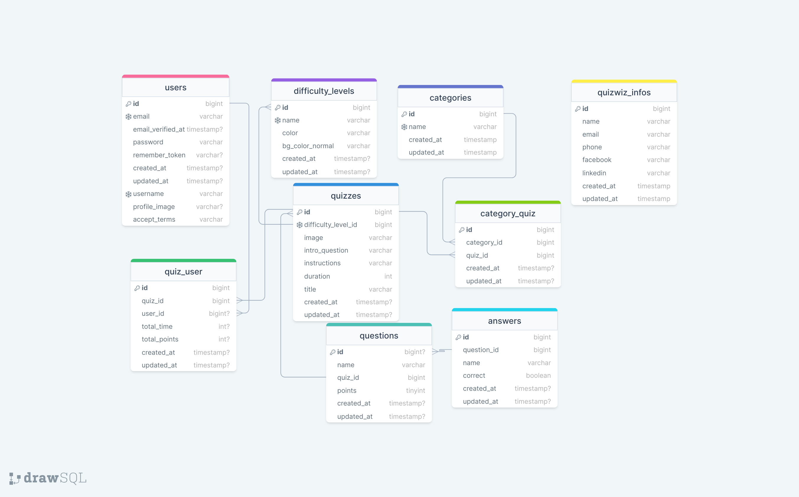

<h1>Quizwiz Application</h1>

---

Welcome to the Quiz App API! This API serves as the backend for providing quiz functionalities to users. It handles user authentication, quiz filtering, submission of quiz attempts, and various other features to enhance the user experience.

## Overview

<p>
The backend of the Quiz App serves as the central logic handler, facilitating communication between the frontend and the database. It manages user interactions, quiz functionalities, and data retrieval to ensure a smooth and efficient experience for users. Built using Laravel and MySQL, it effectively handles user authorizations, quiz data management, submission of quiz attempts, and filtering of data based on user queries.</p>

### Technologies Used

-   Laravel: PHP framework for web and API development, providing tools for routing, authentication, database management, and more.
-   MySQL: Relational database management system used for storing and managing data in Laravel applications.
-   Laravel Sanctum: SPA-based authentication package for securing API endpoints and authenticating users in Laravel applications.
-   Laravel Nova: Administration panel for managing application resources, creating custom dashboards, and simplifying administrative tasks in Laravel applications.

### Prerequisites

-   PHP version 8.0 or higher.
-   MySQL version 8.0 or higher.
-   Composer for managing PHP dependencies.
-   Laravel 11.

### Getting started

1\. Clone the Quizwiz API repository from GitHub.

```sh
git clone https://github.com/RedberryInternship/api-quizwiz-omar-jangavadze
```

2\. Next step requires you to run _composer install_ in order to install all the dependencies.

```sh
composer install
```

3\. Now we need to set our env file. Go to the root of your project and execute this command.

```sh
cp .env.example .env
```

And now you should provide **.env** file all the necessary environment variables:

#

# Laravel Nova

Laravel Nova is an administration panel for managing application resources, creating custom dashboards, and simplifying administrative tasks in Laravel applications.

## Installation

To install Laravel Nova, follow the official documentation [here](https://nova.laravel.com/docs/4.0/installation.html).

## Configuration

Once installed, Laravel Nova can be accessed at `/nova` route of the application.

## Creating Resources

To create custom resources, use Nova's resource classes. Refer to the Nova documentation for more information on creating and customizing resources.

## Further information

For detailed instructions on using Laravel Nova, please refer to the official documentation.

#

**MYSQL:**

> DB_CONNECTION=mysql

> DB_HOST=127.0.0.1

> DB_PORT=3306

> DB_DATABASE=**\***

> DB_USERNAME=**\***

> DB_PASSWORD=**\***

```sh
php artisan config:cache
```

in order to cache environment variables.

#

## Migration

if you've completed getting started section, then migrating database is fairly simple process, just execute:

```sh
php artisan migrate
```

#

### Development

You can run Laravel's built-in development server by executing:

```sh
  php artisan serve
```

#

### API endpoints

1. **Retrieve User Information**

    - **GET** `/user`
    - Description: Retrieves information about the authenticated user.
    - Middleware: `auth:sanctum`

2. **Retrieve Quizwiz Information**

    - **GET** `/quizwiz-info`
    - Controller: `QuizwizInfoController@show`
    - Description: Retrieves information related to Quizwiz.

3. **Quiz Endpoints**

    - **GET** `/quizzes`

        - Controller: `QuizController@index`
        - Description: Retrieves a list of quizzes.
        - Parameters: None

    - **GET** `/quizzes/{quiz}`

        - Controller: `QuizController@show`
        - Description: Retrieves details of a specific quiz.
        - Parameters: `{quiz}` (quiz ID)

    - **GET** `/similar-quizzes`

        - Controller: `QuizController@similarQuizzes`
        - Description: Retrieves a list of quizzes similar to the current quiz.
        - Parameters: None

    - **POST** `/submit-quiz`
        - Controller: `QuizController@store`
        - Description: Submits a quiz attempt.
        - Parameters: Quiz data in the request body

4. **Category Endpoints**

    - **GET** `/categories`
        - Controller: `CategoryController@index`
        - Description: Retrieves a list of quiz categories.
        - Parameters: None

5. **Difficulty Level Endpoints**

    - **GET** `/difficulty-levels`
        - Controller: `DifficultyLevelController@index`
        - Description: Retrieves a list of difficulty levels for quizzes.
        - Parameters: None

6. **Authentication Endpoints**

    - **POST** `/signup`

        - Controller: `AuthController@signup`
        - Description: Registers a new user.
        - Middleware: `guest`

    - **POST** `/login`

        - Controller: `AuthController@login`
        - Description: Logs in a user.
        - Middleware: `guest`

    - **POST** `/logout`

        - Controller: `AuthController@logout`
        - Description: Logs out the authenticated user.
        - Middleware: `auth:sanctum`

    - **POST** `/forgot-password`

        - Controller: `AuthController@forgotPassword`
        - Description: Initiates the password reset process.
        - Middleware: `guest`

    - **POST** `/reset-password`
        - Controller: `AuthController@resetPassword`
        - Description: Resets the user's password.
        - Middleware: `guest`

7. **Email Verification Endpoints**

    - **GET** `/email/verify/{id}/{hash}`

        - Controller: `VerificationController@verify`
        - Description: Verifies the user's email address.
        - Middleware: `signed`

    - **POST** `/email/verification-notification`
        - Controller: `VerificationController@resend`
        - Description: Resends the email verification notification.
        - Middleware: `throttle:6,1`

#

### Project Structure

```bash
├─── app/
├── Actions
│   ├── CompleteQuizAction
# ├── ├── ├── CreateUser
├── Http
│   ├── Controllers
├── ├── ├── AuthController
├── ├── ├── CategoryController
├── ├── ├── DifficultyLevelController
├── ├── ├── QuizController
├── ├── ├── QuizwizInfoController
├── ├── ├── VerificationController
│   └── Middleware
├── ├── ├── AuthenticateSanctumRequest
├── ├── ├── RestrictAuthorizedUsers
│   └── Requests
├── ├── ├── StoreLoginRequest
├── ├── ├── StoreResetPasswordRequest
├── ├── ├── StoreSignupRequest
│   └── Resources
├── ├── ├── AnswerResource
├── ├── ├── CategoryResource
├── ├── ├── QuestionResource
├── ├── ├── QuizIndexResource
├── ├── ├── QuizShowResource
├── ├── ├── UserResource
├── Models
│   ├── Answer
│   ├── Auth
│   ├── Category
│   ├── DifficultyLevel
│   ├── Question
│   ├── Quiz
│   ├── QuizwizInfo
│   ├── User
├── Nova
│   ├── Answer
│   ├── Category
│   ├── DifficultyLevel
│   ├── Question
│   ├── Quiz
│   ├── QuizwizInfo
│   ├── Resource
│   ├── User
├── Providers
bootstrap/
config/
database/
lang/
public/
resources/
routes/
storage/
tests/
vendor/
.env
artisan
composer.json
vite.config.js
```

### FRONTEND

<a href="https://github.com/RedberryInternship/task-manager-omar-jangavadze">Quizwiz Frontend</a>

### Interaction


